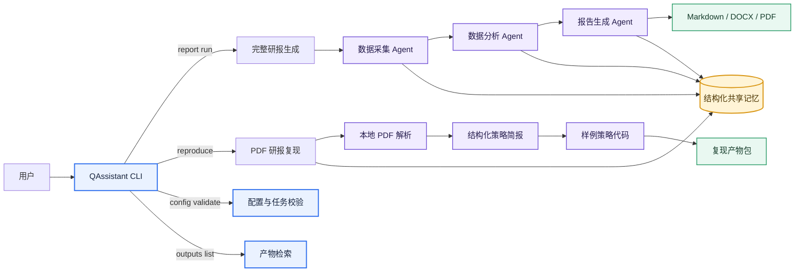
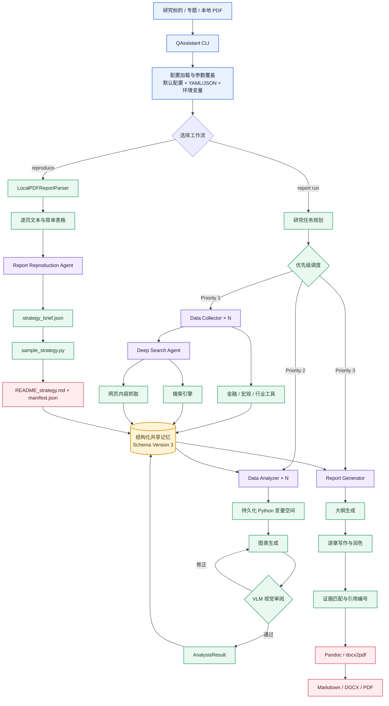
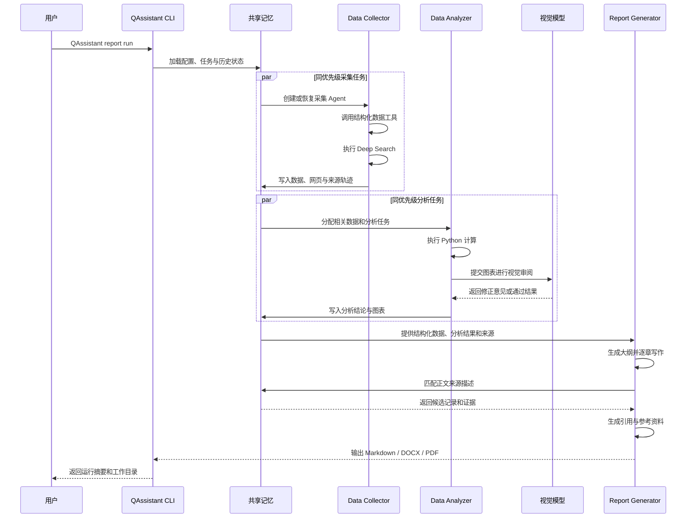
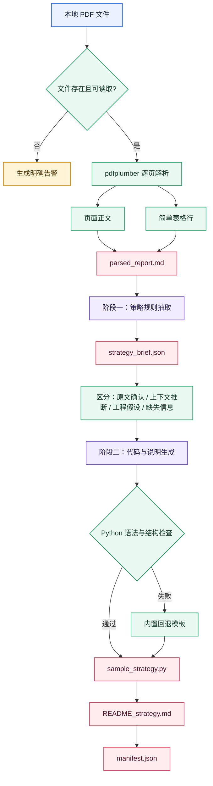

<div align="center">


# QAssistant：面向真实金融场景的多智能体深度研究系统
# BigAlpha 2026 AI 开放创新赛决赛作品

**CLI-first · Evidence-grounded · Code-driven · Reproducible**

*From data to insights, from research reports to auditable strategy prototypes.*

<p>

[](https://arxiv.org/abs/2510.16844)
[](https://www.python.org/)
[](#-命令行工具)

<a href="https://deepwiki.com/RUC-NLPIR/QAssistant"></a>

</p>

**QAssistant** 是一个面向真实金融研究场景的多智能体深度研究系统，覆盖资料采集、数据分析、图表生成、报告撰写、证据引用和多格式交付的完整流程。

以统一命令行工具作为主要交互入口，QAssistant 支持两类核心研究任务：①既可以从一个研究标的出发，自动完成多源资料采集、数据分析、图表生成与完整金融研报交付；②也可以从一份本地 PDF 研报出发，抽取策略逻辑、区分事实与假设，并生成便于人工复核和二次开发的策略代码骨架。

🎯 **One ticker or one PDF, one command, one auditable research artifact.**

<br>

*If this project helps you, please ⭐ star & 🍴 fork!*

</div>

## 📑 目录

- [项目简介](#-项目简介)
- [双工作流设计](#-双工作流设计)
- [系统架构](#️-系统架构)
- [完整研报生成流程](#-完整研报生成流程)
- [PDF 研报复现流程](#-pdf-研报复现流程)
- [快速开始](#-快速开始)
- [配置说明](#️-配置说明)
- [输出结果](#-输出结果)
- [项目结构](#-项目结构)
- [结果示例与评测](#-结果示例与评测)
- [路线图](#️-路线图)
- [Acknowledgments](#-Acknowledgments)

---

## 📌 项目简介

金融深度研究不是一次文本生成，而是一条包含资料采集、数据处理、专业计算、图表表达、论证组织、来源核验和文档交付的长链路任务。QAssistant 将这条链路拆解为多个职责明确的智能体，并通过共享研究状态连接各阶段：

| 智能体 | 主要职责 | 关键输出 |
|---|---|---|
| 📥 **Data Collector** | 调用金融、宏观、行业和网页工具，采集结构化数据与公开资料 | `ToolResult`、搜索摘要、网页正文 |
| 🔍 **Deep Search Agent** | 多轮搜索、候选来源筛选、受控网页访问和内容提取 | 可追踪的搜索与网页证据 |
| 🔬 **Data Analyzer** | 在持久化 Python 变量空间中完成计算、比较、建模和绘图 | `AnalysisResult`、图表、分析说明 |
| 📝 **Report Generator** | 生成大纲、逐章写作、匹配引用并渲染正式报告 | Markdown、DOCX、PDF |
| 📄 **Report Reproduction Agent** | 解析本地 PDF 研报，抽取策略规则并生成复现代码骨架 | 结构化策略简报、Python 样例代码、复现说明 |

与单轮问答式研究工具相比，QAssistant 更关注以下问题：

- **数据是否经过真实计算，而非仅由模型概括；**
- **结论能否回溯至结构化数据、网页来源或 PDF 页码；**
- **长流程中断后能否继续执行，而非从头重跑；**
- **模型推断、工程假设和原文事实能否被明确区分；**
- **最终产物是否可以直接审阅、修改、复现和交付。**

### 适用场景

| 场景 | `target_type` | 典型任务 |
|---|---|---|
| 上市公司研究 | `financial_company` | 公司基本面、财务分析、股价复盘、竞争对手、估值与风险 |
| 宏观研究 | `macro` | 经济指标、政策变化、宏观周期与资产价格影响 |
| 行业研究 | `industry` | 市场规模、供需变化、竞争格局和产业链分析 |
| 通用深度研究 | `general` | 多源资料检索、专题研究、证据梳理和报告生成 |
| 研报策略复现 | CLI `reproduce` | 从本地 PDF 中抽取因子、调仓、风控和输入字段要求，生成样例策略代码 |

> `company` 可作为兼容别名使用，系统内部会映射至金融公司研究类型。

---
## 🔀 双工作流设计

QAssistant 通过统一 CLI 提供两条相互独立、并共享配置体系与研究基础设施的核心工作流。



### 工作流 A：完整金融研报生成

```text
研究标的 / 专题
        ↓
任务规划与配置加载
        ↓
结构化数据采集 + Deep Search
        ↓
Python 分析 + VLM 图表审阅
        ↓
逐章写作 + 证据匹配
        ↓
Markdown / DOCX / PDF
```

### 工作流 B：PDF 研报复现

```text
本地文本型 PDF
        ↓
逐页正文与简单表格解析
        ↓
策略规则结构化抽取
        ↓
事实 / 推断 / 假设 / 缺失信息分层
        ↓
Python 策略代码骨架 + 复现说明 + Manifest
```

---
## 🏗️ 系统架构

### 总体架构



### 分层设计

| 层级 | 主要组件 | 职责 |
|---|---|---|
| 交互层 | `src/cli.py` | 提供统一命令、参数覆盖、JSON 输出和退出状态 |
| 编排层 | `src/pipeline/` | 组织完整研报和 PDF 复现两类流程 |
| 智能体层 | `src/agents/` | 采集、搜索、分析、写作和研报复现 |
| 状态层 | `src/memory/` | 共享记忆、任务映射、证据轨迹、去重和恢复 |
| 工具层 | `src/tools/` | 金融、宏观、行业、网页和文档解析工具 |
| 执行层 | `src/utils/` | LLM、Python 执行器、Embedding 索引、日志和限流 |
| 模板层 | `src/template/` | 报告大纲和 Word 样式模板 |
| 交付层 | `outputs/` | 报告、图表、复现代码、配置和运行状态 |

---
## 🔄 完整研报生成流程

### 端到端流程



### 任务生成与调度

QAssistant 支持两种任务来源：

1. `my_config.yaml` 中的 `custom_collect_tasks` 和 `custom_analysis_tasks`；
2. 系统基于研究标的自动补充的采集与分析任务。

使用 `--no-auto-tasks` 可以关闭自动任务扩展，仅执行用户指定任务。使用 `--tasks-file` 可以将任务从主配置中拆分出来，便于复用不同研究模板。

---
## 📄 PDF 研报复现流程

### 处理流程



### 复现产物

每个 PDF 使用独立输出目录：

```text
outputs/<target_name>/report_reproduction/<report_id>/
├── parsed_report.md       # 按页整理的 PDF 正文与表格
├── strategy_brief.json    # 结构化策略规则与证据
├── sample_strategy.py     # 可阅读、可修改的策略代码骨架
├── README_strategy.md     # 输入字段、假设、缺失信息和使用边界
└── manifest.json          # 模型、页数、告警和产物路径
```

### `sample_strategy.py` 的定位

生成代码是**研报逻辑的样例化表达**，用于人工审阅和二次开发，不是自动完成的实盘策略。该工作流明确不执行：

- 在线下载行情或基本面数据；
- 连接数据库、券商或交易 API；
- 接入真实回测引擎；
- 计算收益率、回撤、夏普比率等绩效指标；
- 对策略有效性作实证判断。

---
## 🚀 快速开始

### 环境要求

- Python 3.10+，推荐使用项目提供的 Python 3.11 Conda 环境；
- Pandoc，用于 Markdown 转 DOCX；
- Chromium / Playwright，用于部分网页搜索和抓取工具；
- LLM、VLM、Embedding 和搜索服务 API Key；
- Microsoft Word 或兼容桌面环境，仅在使用 `docx2pdf` 生成 PDF 时需要。

### 1. 克隆项目

```bash
git clone https://github.com/RUC-NLPIR/QAssistant.git
cd QAssistant
```

### 2. 创建环境

推荐使用 Conda：

```bash
conda env create -f environment.yml
conda activate Competetion
```

`environment.yml` 会安装 Python 3.11、Pandoc，并继续安装 `requirements.txt` 中的 Python 依赖。

未使用 Conda 时：

```bash
python -m venv .venv

# Linux / macOS
source .venv/bin/activate

# Windows PowerShell
# .venv\Scripts\Activate.ps1

python -m pip install --upgrade pip
python -m pip install -r requirements.txt
```

### 3. 安装 CLI

```bash
python -m pip install -e .
```

验证：

```bash
QAssistant --help
```

### 4. 安装浏览器依赖

```bash
python -m playwright install chromium
```

如果只运行本地 PDF 研报复现，且不调用网页搜索工具，可以不安装 Chromium。

### 5. 配置环境变量

```bash
cp .env.example .env
```

编辑 `.env`：

```bash
# 主语言模型：任务规划、数据分析、代码生成和报告写作
DS_MODEL_NAME="deepseek-chat"
DS_BASE_URL="https://api.deepseek.com/v1"
DS_API_KEY="sk-your-key"

# 视觉模型：图表审阅和图表说明
VLM_MODEL_NAME="qwen-vl-max"
VLM_BASE_URL="https://dashscope.aliyuncs.com/compatible-mode/v1"
VLM_API_KEY="sk-your-key"

# Embedding：共享记忆检索、图表和引用匹配
EMBEDDING_MODEL_NAME="text-embedding-v3"
EMBEDDING_BASE_URL="https://dashscope.aliyuncs.com/compatible-mode/v1"
EMBEDDING_API_KEY="sk-your-key"

# 搜索服务
SERPER_API_KEY="your-serper-key"
BOCHAAI_API_KEY="your-bocha-key"

# 同一优先级层最大并发数
MAX_CONCURRENT=3

# 可选：美国宏观数据
FRED_API_KEY="your-fred-key"
```

也可以在 Windows PowerShell 中临时设置环境变量：

```powershell
$env:DS_MODEL_NAME="deepseek-chat"
$env:DS_API_KEY="your_api_key"
$env:DS_BASE_URL="https://api.deepseek.com"
$env:VLM_MODEL_NAME="your_vlm_model"
$env:VLM_API_KEY="your_vlm_key"
$env:VLM_BASE_URL="your_vlm_base_url"
$env:EMBEDDING_MODEL_NAME="your_embedding_model"
$env:EMBEDDING_API_KEY="your_embedding_key"
$env:EMBEDDING_BASE_URL="your_embedding_base_url"
```

PowerShell 中设置的变量仅对当前终端会话生效；长期使用时建议写入项目根目录的 `.env`。

### 6. 配置研究任务

编辑 `my_config.yaml`：

```yaml
target_name: "浪潮信息"
stock_code: "000977"
target_type: "financial_company"  # financial_company | macro | industry | general
output_dir: "./outputs/exp-v1"
language: "zh"                    # zh | en

reference_doc_path: "src/template/report_template.docx"
outline_template_path: "src/template/company_outline_zh.md"

custom_collect_tasks:
  - "资产负债表、利润表、现金流量表"
  - "股票基本信息与股价数据"
  - "股东结构与主要股东"
  - "估值指标与主要竞争对手"

custom_analysis_tasks:
  - "分析公司发展历程、主营业务与增长驱动因素"
  - "分析盈利能力、运营效率、偿债能力和现金流质量"
  - "开展同行业竞争对手比较与估值分析"
  - "复盘近五年股价走势与关键事件"

use_collect_data_cache: true
use_analysis_cache: true
use_report_outline_cache: true
use_full_report_cache: true
use_post_process_cache: true

llm_config_list:
  - model_name: "${DS_MODEL_NAME}"
    api_key: "${DS_API_KEY}"
    base_url: "${DS_BASE_URL}"
    generation_params:
      temperature: 0.7
      max_tokens: 32768
      top_p: 0.95

  - model_name: "${EMBEDDING_MODEL_NAME}"
    api_key: "${EMBEDDING_API_KEY}"
    base_url: "${EMBEDDING_BASE_URL}"

  - model_name: "${VLM_MODEL_NAME}"
    api_key: "${VLM_API_KEY}"
    base_url: "${VLM_BASE_URL}"
```

### 7. 先校验，再运行

```bash
QAssistant config validate --config my_config.yaml
```

如需严格检查环境变量，请先将 `.env` 导出到当前 Shell，再使用 `--strict-env`。

完整研报：

```bash
QAssistant report run --config my_config.yaml --resume
```

PDF 研报复现：

```bash
QAssistant reproduce \
  --config my_config.yaml \
  --pdf-path ./reports/your_report.pdf
```

---
## ⚙️ 配置说明

### 配置覆盖顺序

```text
src/config/default_config.yaml
        ↓
my_config.yaml / 自定义 YAML 或 JSON
        ↓
CLI 参数覆盖（最高优先级）
```

YAML 中可以使用 `${VAR_NAME}` 引用环境变量。配置加载完成后，系统会将最终配置保存至工作目录中的 `config.json`，便于复现运行环境。

### 关键参数

| 参数 | 说明 |
|---|---|
| `target_name` | 研究标的、行业、宏观专题或复现任务名称 |
| `stock_code` | 股票代码；通用研究可以留空 |
| `target_type` | `financial_company`、`macro`、`industry` 或 `general` |
| `market` | 可选市场标识，如 `A`、`HK`、`US` |
| `output_dir` | 所有研究结果的根目录 |
| `language` | 输出语言，支持 `zh` / `en` |
| `reference_doc_path` | Pandoc 生成 DOCX 时使用的 Word 样式模板 |
| `outline_template_path` | 报告大纲参考模板 |
| `custom_collect_tasks` | 用户指定的数据采集任务 |
| `custom_analysis_tasks` | 用户指定的数据分析任务 |
| `rate_limits` | 不同工具类别的调用间隔配置 |
| `MAX_CONCURRENT` | 同一优先级层内最大并发量 |
| `save_note` | 可选输出目录前缀，用于区分实验版本 |

### 独立任务文件

任务文件支持 YAML 或 JSON，也支持两种字段命名：

```yaml
collect_tasks:
  - id: collect_1
    type: collect
    content: "采集近五年三大财务报表"

analysis_tasks:
  - id: analysis_1
    type: analyze
    content: "分析盈利能力和现金流质量"
```

或：

```yaml
custom_collect_tasks:
  - "采集近五年三大财务报表"

custom_analysis_tasks:
  - "分析盈利能力和现金流质量"
```

运行：

```bash
QAssistant report run \
  --config my_config.yaml \
  --tasks-file tasks.yaml
```

---
## 📁 输出结果

默认情况下，完整研报输出到：

```text
{output_dir}/{target_name}/
```

PDF 研报复现产物输出到：

```text
{output_dir}/{target_name}/report_reproduction/{report_id}/
```

### 完整研报输出

每个研究标的使用独立工作目录：

```text
outputs/<experiment>/<target_name>/
├── config.json
├── memory/
│   └── memory.pkl
├── logs/
├── agent_working/
│   ├── agent_data_collector_<id>/
│   │   ├── .cache/latest.pkl
│   │   └── .executor_cache/state.dill
│   ├── agent_data_analyzer_<id>/
│   │   ├── .cache/latest.pkl
│   │   ├── .cache/charts.pkl
│   │   ├── .executor_cache/state.dill
│   │   └── images/
│   └── agent_report_generator_<id>/
│       └── .cache/
│           ├── outline_latest.pkl
│           ├── section_0.pkl
│           ├── section_1.pkl
│           └── report_latest.pkl
├── <report_title>.md
├── <report_title>.docx
└── <report_title>.pdf
```

### PDF 复现输出

```text
outputs/<target_name>/
├── config.json
├── logs/
├── agent_working/
│   └── agent_report_reproduction_<id>/
│       └── .cache/report_reproduction_latest.pkl
└── report_reproduction/
    └── <report_id>/
        ├── parsed_report.md
        ├── strategy_brief.json
        ├── sample_strategy.py
        ├── README_strategy.md
        └── manifest.json
```

### `manifest.json` 示例

```json
{
  "report_id": "factor_report_v1",
  "source_pdf": "reports/factor_report.pdf",
  "generated_at": "2026-08-01T10:30:00",
  "model_name": "deepseek-chat",
  "page_count": 42,
  "parsed_page_count": 42,
  "warnings": [],
  "artifacts": {
    "parsed_report_md": ".../parsed_report.md",
    "strategy_brief_json": ".../strategy_brief.json",
    "sample_strategy_py": ".../sample_strategy.py",
    "readme_strategy_md": ".../README_strategy.md",
    "manifest_json": ".../manifest.json"
  }
}
```

---
## 📂 项目结构

```text
QAssistant/
├── assets/                              # Logo、架构图、结果示例和评测图片
├── docs/
│   └── ADVANCED_USAGE.md                # 进阶使用说明
├── demo/                                # 历史 Web 演示代码；CLI 核心流程不依赖
├── src/
│   ├── cli.py                           # QAssistant 命令行入口
│   ├── pipeline/
│   │   ├── config_utils.py              # 配置、任务校验与产物检索
│   │   ├── report_runner.py             # 完整研报 Pipeline Runner
│   │   └── reproduction_runner.py       # PDF 研报复现 Pipeline Runner
│   ├── agents/
│   │   ├── base_agent.py                # CAVM 基类、工具调用和检查点恢复
│   │   ├── data_collector/              # 数据采集 Agent
│   │   ├── search_agent/                # 深度搜索和来源验证 Agent
│   │   ├── data_analyzer/               # Python 分析和 VLM 图表反馈 Agent
│   │   ├── report_generator/            # 大纲、章节、引用和文档渲染 Agent
│   │   └── report_reproduction/         # PDF 研报复现 Agent 与提示词
│   ├── memory/
│   │   ├── memory.py                    # 结构化共享记忆核心实现
│   │   ├── variable_memory.py           # 兼容旧导入路径
│   │   └── prompts/                     # 任务规划和数据选择提示词
│   ├── tools/
│   │   ├── base.py                      # Tool / ToolResult 抽象
│   │   ├── document/
│   │   │   └── pdf_report_parser.py     # 本地 PDF 文本与表格解析工具
│   │   ├── financial/                   # 公司、财务报表、股票和指数工具
│   │   ├── macro/                       # 中国及美国宏观数据工具
│   │   ├── industry/                    # 行业和经济活动指标工具
│   │   └── web/                         # 搜索引擎、浏览器和网页抓取工具
│   ├── config/                          # 默认配置、模型和限流器初始化
│   ├── template/                        # 报告大纲和 Word 样式模板
│   └── utils/                           # LLM、执行器、索引、日志与运行上下文
├── tests/                               # CLI、Pipeline、PDF、Agent、工具和记忆测试
├── .env.example
├── environment.yml
├── my_config.yaml
├── pyproject.toml                       # 包配置与 QAssistant CLI 注册
├── requirements.txt
├── run_report.py                        # 完整研报兼容入口
└── run_report_reproduction.py           # PDF 研报复现兼容入口
```

---
## 🎨 结果示例与评测

### 报告示例

<div align="center">

| | |
|:---:|:---:|
|  |  |
| **核心收入分析** | **多维财务数据分析** |
|  |  |
| **出版级报告排版** | **图表驱动的研究结论** |

</div>

完整示例报告位于 `assets/example_reports`（如仓库中提供）。


### 评测结果

根据项目论文披露的实验结果，QAssistant 与 OpenAI Deep Research、Gemini 2.5 Pro Deep Research 等系统进行了对比，综合评分达到 **8.09**。

<div align="center">

| | |
|:---:|:---:|
|  |  |
| **与 Deep Research 系统的综合对比** | **关键事实召回与引用权威性** |

</div>

论文实验结论包括：

- 综合评分高于实验中的 Gemini 2.5 Pro Deep Research 和 OpenAI Deep Research；
- 两阶段写作框架提升了信息丰富度与分析深度；
- 视觉增强机制改善了图表质量，原实验中的可视化评分为 **9.00**。

详细实验设置、数据集和评价方法请参阅[项目论文](https://arxiv.org/abs/2510.16844)。

> 上述评测针对完整金融研报生成流程，不应直接外推为 PDF 研报复现代码的质量评价或策略有效性结论。

---
## 🗺️ 路线图

- [x] 多智能体协同研究流程：采集 → 分析 → 报告
- [x] CAVM 代码智能体与持久化变量空间
- [x] 结构化共享记忆、来源轨迹和版本合并
- [x] VLM 图表生成与视觉反馈优化
- [x] 任务级、图表级、章节级和后处理级断点恢复
- [x] 同优先级任务受控并发
- [x] 统一 `QAssistant` 命令行工具
- [x] 配置文件与任务文件预校验
- [x] 本地 PDF 页级文本和简单表格解析
- [x] 研报复现 Agent 与结构化策略简报
- [x] 样例策略代码语法检查和回退模板
- [ ] 集成 OCR，支持纯扫描 PDF
- [ ] 增强复杂表格、公式和图表结构解析
- [ ] 为策略代码提供可插拔数据适配器和回测框架接口
- [ ] 建立 Claim–Evidence 级结论证据映射
- [ ] 将评分扩展至来源权威性、时效性和交叉验证
- [ ] 支持更多全球市场、资产类别和专业研究模板

---
## 🙏 Acknowledgments

- [AkShare](https://akshare.akfamily.xyz/)：金融和宏观数据接口；
- [eFinance](https://github.com/mpquant/efinance)：股票数据工具；
- [Crawl4AI](https://github.com/unclecode/crawl4ai)：网页内容抓取；
- [pdfplumber](https://github.com/jsvine/pdfplumber)：本地 PDF 文本和表格解析；
- [Pandoc](https://pandoc.org/)：Markdown 和 Word 文档转换。

---

<div align="center">

### QAssistant

**让金融研究从内容生成走向证据组织、真实计算、研报复现与专业交付。**

</div>
